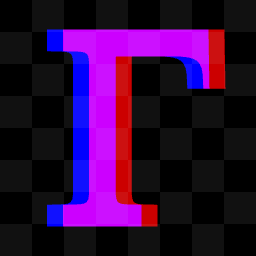

# Gamma

Gamma is a WIP comprehensive game library written in pure javascript, making use of Web APIs such as WebGL2 and Web Audio.

- 🚀 Very performant and light (not 15 layers of abstraction glued together)
- 🧩 Custom GLSL Shaders
- 📦 3D support
- 👍 Simple API that feels like `Canvas2D`
- 🔌 Bridge between low/high-level rendering
- 📖 Permissive license
- 🚫 Absolutely no AI-written code

Gamma has two primary goals to set itself apart from existing graphics/multimedia libraries:
- Provide a high-level interface at a low-level performance
- First-class support for incredibly general implementations of constructs such as text rendering or accessibility, which lets you do much more than other solutions such as Unity or HTML without reinventing the wheel.


# Simple example
```html
<canvas id="canvas"></canvas>
<script type="module">
	import "path/to/gamma/min/monolith.min.js"
	// Load and import Gamma globally
	Gamma(globalThis, document.getElementById('canvas'))
	// Load Gamma extensions
	Gamma.font(globalThis)
	Gamma.util(globalThis)

	const cat = await Texture.from('./cat.png')

	loop(() => {
		// Runs every frame

		// Resize canvas if needed
		const width = innerWidth * devicePixelRatio, height = innerHeight * devicePixelRatio
		if(width != canvas.width || height != canvas.height){
			setSize(width, height)
		}
		canvas.style.transform = `scale(${1 / devicePixelRatio})`

		// Rendering logic

		// Default transform puts the entire canvas surface at (0,0)-(1,1)
		ctx.translate(0.5, 0.5)
		ctx.scale(1 / width, 1 / height)

		const catSize = height*0.5
		ctx.scale(catSize)
		ctx.rotate(t)
		ctx.drawRect(-0.5, -0.5, 1, 1, cat)
	})
</script>
```

# Status

Gamma is well into development, with approximately 4,300 lines of code and a 100KB minified build, however, many key features are yet to be implemented. Keep an eye out, or [consider contributing](https://donate.stripe.com/9B6dR8gPgdoA5aP14l9bO03)!

### Gamma
- 2D and 3D support
- Custom geometries (models)
- Custom GLSL shaders
- Creating and manipulating Textures of any format
- Custom blend modes and draw masks
- Render to texture, including MRT
- Access to stencil/depth buffer for more complex drawing techniques
- Greedy sprite batching

### Gamma.font
- SDF/MSDF rendering, see [Chlumksy's tool](https://github.com/Chlumsky/msdf-atlas-gen) based on his amazing work on the [MSDF rendering technique](https://github.com/Chlumsky/msdfgen/files/3050967/thesis.pdf)
- Text-breaking and text-measuring algorithm for rich text involving multiple styles
- Support for directly manipulating font glyphs and font kerning

### Gamma.input
- Mouse and keyboard input, exposed in both an event-based and query-based interface
- Touch, stylus and gamepad (e.g controller) input
- Recursive, highly manipulable and relatively _novel_ event propagation system
- **TODO** Gyroscope/accelerometer input
- **TODO** Microphone input

### Gamma.gui
- Hierarchical GUI library with strong interoperability with low level rendering techniques
- Conditional rerendering for performance / energy efficiency
- `ParticleContainer` for quick particle effects
- Textfield inputs with accessibility (both single- and multi-line, making use of `Gamma.font`)
- **TODO** Prebuilt buttons, sliders, etc... with accessibility

### Gamma.wave
This extension is planned but development has not yet been started. It will add support for importing, playing, mixing, and procedurally generating audio.

### Gamma.util
- Misc. useful JS utilities relevant for graphical applications
- Capturing screenshots/screen recordings
- Downloading files
- Buffer serialization library for networking or savedata
- **TODO** Local DB store
- **TODO** Spatial indexing in 2D or 3D
- And likely more...